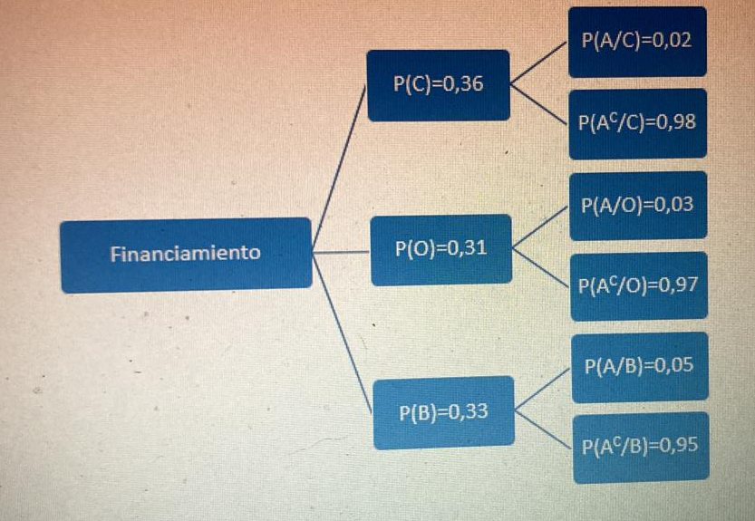

---
output:
  pdf_document: default
  latex_engine: xelatex
  number_sections: yes
  toc: yes
  word_document: default
tables: yes
params:
  n_canton: 1
  imagen: null
---

```{r setup, include=FALSE}
rm(list = ls())
knitr::opts_chunk$set(warning = FALSE, message = FALSE) 

```


\pagebreak

# Contenidos Generales

1.- Introducción.\
2.- Presentación de Tablas o Datasets.\
3.- Librerías a Utilizar.\
4.- Cargas de datos, conexión y presentación tabla original.\
5.- Análisis Exploratorio.\
5.1.- Buscando Valores Nulos.\
5.2.- Sumarizando en datamov para ver cuantos datos únicos existen en cada columna.\
5.3.- Estructura de una Datasets Estud sin modificar su estructura.\
5.4.- Nueva Estructura Estructura de una Datasets Estud.\
6.- Resumen de Variables.\
6.1.- Resumen Analítico.\
7.- Resumen Gráfico.\
7.1 .- Estrato Social v/s Salarios de las personas.\
7.2 .- Graficando las variables salario y la variable género.\
7.3.- Tabla resumen para datos Financiación, Edad, Ingreso, Puntaje.\
7.4.- Tabla resumen para datos Cualitativos.\
8.- Determinar las medidas Estadísticas.\
9.- Relación entre variables cuantitativas de Edad e Ingresos.\
9.1.- Diagramas de Dispersión.\
9.2.- Correlación entre Edad e Ingreso.\
10.- Construya una tabla de Frecuencia o tabla de contingencia con Financiamiento y Clases, parte 2.\
10.1.- Creando tablas de Frecuencias.\
10.2.- Determine la probabilidad de elegir a un estudiante al azar, que tenga beca y prefiera clases virtuales.\
10.3.- Si se elige a un estudiante al azar que prefiere clases presenciales.\
10.4.- La probabilidad condicionada de un estudiante.\
11.- Considere la variable Fuma, de la muestra obtenida en la Parte N°3.\
12.- Variable Ingreso (en millones de pesos), parte N°4.\
13.- Conclusión.\

\pagebreak

# 1.- Introducción.

<p align="justify">

Para la realización del presente informe, nuestro objetivo es llevar a cabo nuestras visualizaciones para explicar de que se trata nuestros datos, como se expanden tantos en sus densidades y distribuciones, como van sus medidas estadísticas, crear tablas con las variables cualitativas y variables cuantitativas, se tomará una muestra de 150 filas de entre los 100 y 250, de este grupo realizamos el estudio, las variables para tal estudio se seleccionará un total de 8 variables, 5 cualitativas y 3 cuantitativas, para llevar a cabo, se analizará la Datasets llamada Estudiantes, con el propósito de analizar dicho conjunto de datos y obtener información relevantes que nos permita obtener resultados con variables tantos cualitativas como también variables cuantitativas, para lo cual, se realizara un limpieza de datos, corrección de campos, para lo cual obtendremos algunas medidas estadísticas, que nos permita crear una tabla de frecuencia, para determinar probabilidades, por ende utilizaremos diferentes paquetes de carga de datos que nos facilitarán el proceso de cálculos, gráficos y presentaciones.
</p>

# 2.- Presentación de Tablas o Datasets.

Nuestro conjunto de datos contendrá sus datos como lo representa en el cuadro de variables, clasificándolos por el valor de sus atributos, para ello, verificamos que tipos variables tenemos a mano.

+--------------+-----------------------------------+--------------------------+----------------------------+
| Variables    | Significado                       | Codificación             | Tipo dato                  |
+==============+===================================+==========================+============================+
| ID           | Código de ID                      | codigo                   | Identificador              |
+--------------+-----------------------------------+--------------------------+----------------------------+
| Sexo         | Género                            | 0=Masculino, 1=Femenino  | Cualitativa (Factor)       |
+--------------+-----------------------------------+--------------------------+----------------------------+
| Edad         | Edad                              | Numérica de 12 a 30      | Discreta Numérica          |
+--------------+-----------------------------------+--------------------------+----------------------------+
| Fuma         | Fuma                              | Fuma (Si - No)           | Cualitativa Ordinal        |
+--------------+-----------------------------------+--------------------------+----------------------------+
| Estatura     | Estatura                          | Alta-Baja-Media          | Cualitativa Ordinal        |
+--------------+-----------------------------------+--------------------------+----------------------------+
| Colegio      | Tipo Procedencia de colegio       | Privado-Público          | Cualitativa Nominal        |
+--------------+-----------------------------------+--------------------------+----------------------------+
| Estrato      | Estrato socio económico vivienda  | 1=Bajo,2=Medio,3=Alto    | Cualitativa Ordinal Factor |
+--------------+-----------------------------------+--------------------------+----------------------------+
| Financiación | Medio Fianciación Universidad     | Beca, Credito, Otro      | Cualitaitva Nominal        |
+--------------+-----------------------------------+--------------------------+----------------------------+
| Acumulado    | Prom. Acumulado al finalizar      | Numérico a 0.0 a 5.0     | Cuantitativa Continua      |
|              |                                   |                          |                            |
|              | Semestre anterior.                |                          |                            |
+--------------+-----------------------------------+--------------------------+----------------------------+
| Gastos       | Promedio de sus gastos Mensuales. | Numérica de 23.0 a 90.0  | Cuantitativa Continua      |
+--------------+-----------------------------------+--------------------------+----------------------------+
| Ingreso      | Ingreso mensual de su padre       | Numérica de 1.0 a 3.0    | Cuantitativa Continua      |
+--------------+-----------------------------------+--------------------------+----------------------------+
| Clases       | ¿Que tipo de clases prefiere?     | Virtual, Presencial      | Cualitativa Nominal        |
+--------------+-----------------------------------+--------------------------+----------------------------+
| Pandemia     | Cree usted que la pandemia        | 1=Totalmente de acuerdo  | Cualitativa Nominal        |
|              |                                   |                          |                            |
|              | afectó economicamente             | 2= En desacuerdo         |                            |
|              |                                   |                          |                            |
|              | a su familia.                     | 3= Ni de acuerdo, ni en  |                            |
|              |                                   |                          |                            |
|              |                                   | desacuerdo;              |                            |
|              |                                   |                          |                            |
|              |                                   | 4=De acuerdo;            |                            |
|              |                                   |                          |                            |
|              |                                   | 5=Totalmente de acuerdo  |                            |
+--------------+-----------------------------------+--------------------------+----------------------------+
| Clases       | Me preocupa que tal vez no        | 1=Totalmente de acuerdo  | Cualitativa Nominal        |
|              |                                   |                          |                            |
| Virtuales    | pueda entender los contenidos     | 2= En desacuerdo         |                            |
|              |                                   |                          |                            |
|              | de mis asignaturas como           | 3= Ni de acuerdo, ni en  |                            |
|              |                                   |                          |                            |
|              | me gustaría.                      | desacuerdo               |                            |
|              |                                   |                          |                            |
|              |                                   | 4=De acuerdo;            |                            |
|              |                                   |                          |                            |
|              |                                   | 5= Totalmente de acuerdo |                            |
+--------------+-----------------------------------+--------------------------+----------------------------+
| Estadística  | Me gusta la estadística           | 1=Totalmente de acuerdo  | Cualitativa Nominal        |
|              |                                   |                          |                            |
|              |                                   | 2= En desacuerdo         |                            |
|              |                                   |                          |                            |
|              |                                   | 3= Indeciso              |                            |
|              |                                   |                          |                            |
|              |                                   | 4= De acuerdo            |                            |
|              |                                   |                          |                            |
|              |                                   | 5= Totalmente de acuerdo |                            |
+--------------+-----------------------------------+--------------------------+----------------------------+
| Inseguridad  | Me siento inseguro cuando         | 1=Totalmente de acuerdo  | Cualitativa Nominal        |
|              |                                   |                          |                            |
|              | hago problemas de                 | 2= En desacuerdo         |                            |
|              |                                   |                          |                            |
|              | estadistica.                      | 3= Indeciso              |                            |
|              |                                   |                          |                            |
|              |                                   | 4= De acuerdo            |                            |
|              |                                   |                          |                            |
|              |                                   | 5= Totalmente de acuerdo |                            |
+--------------+-----------------------------------+--------------------------+----------------------------+
| Vida         | Utilizo la estadística en         | 1=Totalmente de acuerdo  | Cualitativa Nominal        |
|              |                                   |                          |                            |
| Cotidiana    | la vida cotidiana.                | 2= En desacuerdo         |                            |
|              |                                   |                          |                            |
|              |                                   | 3= Indeciso              |                            |
|              |                                   |                          |                            |
|              |                                   | 4= De acuerdo            |                            |
|              |                                   |                          |                            |
|              |                                   | 5= Totalmente de acuerdo |                            |
+--------------+-----------------------------------+--------------------------+----------------------------+
| Puntaje      | Porcentaje de acierto             | Numérica de 0 a 100%     | Cuantitativa Discreta      |
|              |                                   |                          |                            |
|              | en una determinada                |                          |                            |
|              |                                   |                          |                            |
|              | prueba.                           |                          |                            |
+--------------+-----------------------------------+--------------------------+----------------------------+
|              |                                   |                          |                            |
+--------------+-----------------------------------+--------------------------+----------------------------+

<p align="justify">

Datasets recogida aplicando una encuesta de muestra de estudiantes universitarios. Es un Dataframe con 400 observaciones, y 18 variables, que se describen en la tabla 1, además, lo que se realizará es una limpieza, y se realizara un reestructuración de sus variables, se seleccionara algunas como para poder realizar una observación de ellas y entenderlas, por ende, necesitaremos una serie de librerías que dejaremos escritos y por lo cual nos permitirá ejecutar nuestro código, teniendo como objetivos, realizar una exploración, visualización y explicaremos nuestras visualizaciones, tanto en las sumarizaciones, consultas y gráficos.

<p/>

# 3.- Librerías a Utilizar.

</p align="justify">

Librerías presentadas para trabajos de ejecución de los códigos a presentar en el conjuntos de los 150 registros tomados, de los alumnos, para lo cual, se van a analizar.

</p>

library(knitr) para trabajar en la configuración del proyecto y uso de tablas\
library(RColorBrewer) uso para los graficos si se necesita\
library(ggplot2) es una librería para visualizar datos\
library(dplyr) librería para trabajos de consultas con pipe\
library(kableExtra) permite cargar tablas presentación\
library(readr) lectura de dataset en csv\
library(readxl) lectrua en dataset excel\
library(DT) permite crear tablas\
library(GGally), permite obtener graficos\
library(RColorBrewer) # colores de gráficos\
library(lessR) Para porcentajes de pie\
library(PerformanceAnalytics) librería para realizar analíticas\

```{r, echo=FALSE}
if(!require(knitr)) { install.packages("knitr"); library(knitr) } # trabajos proyecto y tablas
if(!require(readxl)) { install.packages("readxl"); library(readxl) } # lectura de archivo xlsx
if(!require(stringr)) { install.packages("stringr"); library(stringr) } # reconocimientos strigr
if(!require(readr)) { install.packages("readr"); library(readr) } # lectura de documento csv
if(!require(dplyr)) { install.packages("readr"); library(dplyr) } # paquete consulta tablas
if(!require(kableExtra)) { install.packages("kableExtra"); library(kableExtra) } # librería  de tablas
if(!require(ggplot2)) { install.packages("ggplot2"); library(ggplot2) } #paquetes de gráficos
if(!require(GGally)) { install.packages("GGally"); library(GGally) } # libreria para gráficos
if(!require(PerformanceAnalytics)) { install.packages("PerformanceAnalytics"); library(PerformanceAnalytics) }
library(knitr)
library(RColorBrewer)
library(ggplot2)
library(proto)
library(dplyr)
library(kableExtra)
library(readr)
library(readxl)
library(GGally)
library(RColorBrewer) # colores de gráficos
library(PerformanceAnalytics)

```

# 4.- Cargas de datos, conección y presentación tabla original.

<p align="justify">

Cargamos los datos del archivo xlsx, y lo conectamos para luego seleccionar una muestra de 150 filas para trabajar en el proyecto.

</p>

```{r, echo=FALSE}
# carga de la datasets Estudiantes

Estud <- read_excel("C:/Users/salop/OneDrive/Escritorio/EnvR/MagisterUdla/AnalisisEstadistico_Viviam_Salomon/Estudiantes.xlsx") #cargamos la data xlsx
Estud<-Estud[100:249,] #cantidad seleccionada para la muestra es 150 datos

Estud<-data.frame(Estud) # la convertimos en dataframe

Estudi<-Estud[,c("ID","Sexo","Edad","Fuma","Estatura","Colegio","Estrato")] # seleccionamos las tablas
head(Estudi,3) %>% 
  kable(booktabs = TRUE,format = "latex", caption = "\\label{tabla2}Presentación Primera Mitad tabla Actual a Trabajar") %>% 
  kable_styling( latex_options = c("striped", "condensed","hold_position","scale_down"), position="left")

```

```{r,echo=FALSE}
Estudi2<-Estud[,c("Financiacion","Acumulado","Gastos","Ingreso","Clases","Pandemia")] #selección de campos
head(Estudi2,3) %>% 
  kable(booktabs = TRUE,format = "latex", caption = "\\label{tabla3}Presentación Segunda Mitad tabla Actual a Trabajar") %>% 
  kable_styling( latex_options = c("striped", "condensed","hold_position","scale_down"), position="left")

```

```{r, echo=FALSE}
Estudi3<-Estud[,c("Clases_virtuales","Estadistica","inseguridad","vida_cotidiana","Puntaje")]
head(Estudi3,6) %>% 
  kable(booktabs = TRUE,format = "latex", caption = "\\label{tabla4}Presentación Tercera Mitad tabla Actual a Trabajar") %>% 
  kable_styling( latex_options = c("striped", "condensed","hold_position","scale_down"), position="left")

```

\pagebreak

# 5.- Análisis Exploratorio.

Nuestro objetivo es verificar si hay valores nulos, verificar cuantos valores son únicos.

## 5.1.- Buscando Valores Nulos.

<p align="justify">

Buscando $NA$ con la función tapply, de cada columna de la Datasets Estud, haciendo el resumen general.

</p>

```{r, echo=FALSE}
apply(X = is.na(Estud), MARGIN = 2, FUN = sum)  
  
  
```

: Se observa que los campos estan completos sin valores NA.

## 5.2.- Sumarisando en datamov para ver cuantos datos unicos existen en cada columna.

Aquí presentamos la Datasets original pero mostrando en dos partes los valores únicos.

```{r, echo=FALSE}
Estudiuni<-Estud[,c("ID","Sexo","Edad","Fuma","Estatura","Colegio","Estrato","Financiacion","Acumulado","Gastos")]
Estudiuni %>% summarise_all(funs(n_distinct(.))) %>% 
  kable(booktabs = TRUE,format = "latex", caption = "\\label{tabla5}Presentación valores unicos de la tabla original priemra parte") %>% 
  kable_styling( latex_options = c("striped", "condensed","hold_position","scale_down"), position="left")

```

```{r, echo=FALSE}
Estudiuni2<-Estud[,c("Ingreso","Clases","Pandemia","Clases_virtuales","Estadistica","inseguridad","vida_cotidiana","Puntaje")]
Estudiuni2 %>% summarise_all(funs(n_distinct(.))) %>% 
  kable(booktabs = TRUE,format = "latex", caption = "\\label{tabla6}Presentación Datos únicos en cada columna de la tabla original segunda parte") %>% 
  kable_styling( latex_options = c("striped", "condensed","hold_position","scale_down"), position="left")


```

## 5.3.- Estructura de una Datasets Estud sin modificar su estructura.

Presentación de la Estructura de la dataset original, sin cambios a realizar aún.

```{r,echo=FALSE}
glimpse(Estud) # visualizando la estructura original
```

```{r,echo=FALSE}
Estud$Puntaje[Estud$Puntaje == 0] <-32 #reemplazamos un valor cero por un promedio del atriburo puntaje

DEstudia<-data.frame(ID=(Estud$ID),Sexo=Estud$Sexo,Edad=round(as.numeric(Estud$Edad)),Fuma=Estud$Fuma,               Estatura=Estud$Estatura,Colegio=Estud$Colegio,Estrato=round(as.numeric(Estud$Estrato)),
                     Financiacion=Estud$Financiacion,Acumulado=(as.numeric(Estud$Acumulado)),
                     Gastos=round(as.integer(Estud$Gastos)),                    Ingreso=(as.numeric(Estud$Ingreso)),Clases=Estud$Clases,Pandemia=Estud$Pandemia,                     Clases_virtuales=Estud$Clases_virtuales,Estadistica=Estud$Estadistica,                     Inseguridad=(as.character(Estud$inseguridad)),vida_cotidiana=Estud$vida_cotidiana,Puntaje=round(Estud$Puntaje))


```

## 5.4.- Nueva Estructura Estructura de una Datasets Estud.

<p align="justify">

Se decidió crear un nuevo dataframe para reorganizar la estructura de la Datasets, esto implica que se debió aplicar las funciones as.numeric, as.character y round para redondear los números decimales a números enteros como los campos edad, estrato, acumulado, gastos , ingresos, etc.

<p/>

DEstudia<-data.frame(ID=(Estud$ID),Edad=round(as.numeric(Estud$Edad)),\
Fuma=Estud$Fuma,Estatura\
=Estud$Estatura, Colegio=Estud$Colegio,Estrato=round(as.numeric(Estud$Estrato)),\
Financiacion=Estud$Financiacion, Acumulado=(as.numeric\
(Estud$Acumulado)),Gastos=(as.numeric(Estud$Gastos)),Ingreso=(as.numeric
(Estud$Ingreso)),Clases=Estud$Clases,Pandemia=Estud$Pandemia,\
Clases_virtuales=Estud$Clases_virtuales,Estadistica=Estud$Estadistica,\
Inseguridad=(as.character(Estud$inseguridad)), vida_cotidiana=
Estud$vida_cotidiana$,Puntaje=Estud$Puntaje)\

> a continuación se verá la nueva estructura que se estableció en la dataset Original con la función glimpse()

```{r,echo=FALSE}
glimpse(DEstudia)# usando glimpse para ver sus estructura
```

# 6.- Resumen de Variables.

<p align="justify">

En este aparatado realizaremos la selección de 3 variables cuantitativas y 5 variables cualitativas, para este estudio se elegirá las cuantitativas (Edad, Ingresos, Puntaje), en cualitativas (Sexo, Colegio, Estrato, Financiacion, Clases)

</p>

```{r,echo=FALSE}
names(DEstudia)
Estuvar<-DEstudia[,c("Sexo","Colegio","Estrato","Financiacion","Clases","Edad","Ingreso","Puntaje")]

head(Estuvar,3) %>% 
  kable(booktabs = TRUE,format = "latex", caption = "\\label{tabla6}Presentación de las columnas a Trabajar") %>% 
  kable_styling( latex_options = c("striped", "condensed","hold_position","scale_down"), position="left")
```

: Según lo visto en la estructura tenemos 8 columnas nuevas creadas 5 cualitativas y 3 cuantitativas lo que podremos resumir y estudiar.

## 6.1.- Resumen Analítico.

Para saber como van conformado nuestras variables, realizamos un resumen general.

```{r}

summary(Estuvar)# suamrio general de las variables de al tabla Estuvar

```

: Podemos inferior que tenemos 5 variables cualitativas para lo cual crearemos algunas tablas para poder interpretar sus gráficos, pero también tenemos 3 variable cuantitativas que podemos notar su dispersión y distribución.

1.- Estrato. - Tiene su media y su mediana bien cerca lo que puede que su distribución sea más homogénea, indicando que su máximo esta por sobre la media del tercer cuartil y sus valores se aglomeran arriba.

2.- Edad. - la edad media ronda los 19 años, lA mayoría ronda entre los 17 Y 20 AÑOS. su distribución es más uniforme.

3.- Ingresos. - su mediana y media están no tan separados, pero si gran parte ronda entre los 1.070 y los 1.765 en millones. habrá que estudiar sus valores más bajos.

4.- Puntaje a simple vista tenemos unos valores atípicos, su media está un poco no pareja pero su gran concentración esta entre los 20 y 35.

# 7.- Resumen Gráfico.

<p align="justify">

Presentación de un resumen general, donde se puede apreciar las 5 campos(variables), se lee de forma interceptando entre ellos, donde se puede observar cómo están su distribución, dispersión y clasificación, para lo cual debemos fijarnos en cada intercepto respecto a su variables a comparar, para ello nos dará una visión general, como están distribuidos los datos y su dispersión de ellos, si hay valores atípicos o no, ahora, a continuación veremos la distribución por cada una de las variables seleccionadas.

</p>

```{r, echo=FALSE,out.width='70%',fig.align='center',fig.pos='H'}
colnam<-c("Financiacion","Clases","Edad","Ingreso","Puntaje")
ggpairs(DEstudia, columns = colnam, aes(color = Estrato, alpha = 0.5),
        upper = list(continuous = "points"))

```

## 7.1 .- Estrato Social v/s Salarios de las personas.

<p align="justify">

En definitiva, veremos cómo se presentan los datos en un gráfico de barra que nos permitirá ver en qué tipo estrato social gana más dinero o verificar como podrían estar distribuidos. sabiendo que 1=bajo, 2=medio, 3=alto. y su ingreso en millones.

</p>

```{r, echo=FALSE, out.width='70%', out.height='40%',fig.align='center',fig.pos='H'}
par(mfrow = c(1, 2))
# Creamos un histograma
hist(Estuvar$Ingreso, freq = FALSE, main = "Densidad del Ingreso",
     ylab = "Densidad", xlab = "Ingreso en Millon",col = "cyan", border = "blue")

boxplot(Estuvar$Ingreso ~ Estuvar$Estrato, main="Ingreso Social",xlab = "Estrato Social", ylab = "Salario en millones",col = "cyan", border = "blue")


```

<p align="justify">

En el Gráfico de la densidad del ingreso, tenemos que el ingreso más alto, la mayoría está en 1 a 1.2 millones, teniendo un ingreso más bajo la minoría que está en los 2.5 a 3 millones.

</p>

<p align="justify">

En el Gráfico de Ingreso social tenemos nivel bajo, medio y alto, aquí tenemos unos valores atípicos, en nivel alto de clasificación, que sobresalen de sus límites de 2.5 millones, los tres salarios de sus clases sociales están dispares siendo en nivel bajo en 1.4 millones, en nivel medio en 1.5 millones, y nivel alto en 1.3 millones, se observa entre segundo y tercer cuartil lo siguiente: en nivel bajo en 1.2 a 1.8 millones, en nivel medio 1.3 a 1.9, en nivel alto 1,1 a 1,65 millones.

</p>

## 7.2 .- Graficando las variables salario y la variable género

```{r, echo=FALSE, out.width='70%', out.height='40%',fig.align='center',fig.pos='H'}
par(mfrow = c(1, 2))
hist(Estuvar$Ingreso,
     breaks = 4,   
     main = "Montos en Millones", 
     xlab = "Salario",                                          
     ylab = "Número de personas",
     xlim = c(0,4),                      # rango de valores del eje x
     col = "cyan",                        # color de relleno
     border = "white",                     # color del borde del rectángulo
     
     )

barplot(table(Estuvar$Sexo),xlab = "Genero", main = "Total por Género",ylab = "Cantidad Personas", col = "cyan", border = "white")
```

<p align="justify">El Gráfico en monto en millones, se observa que esta gran parte en 1.0 a 1.5 millones, viendo por cifras generales en una muestra de 150 filas, lo que nos da un total de 69 personas y los más bajo 6 personas y lo más alto 2 o 3 personas.</p>

<p align="justify">En el Gráfico de género la verificamos que tenemos más estudiantes femeninos que están por sobre los 84 y menos el total de hombres que son 66 en total.</p>

## 7.3.- Tabla resumen para datos Financiación, Edad, Ingreso, Puntaje.

```{r, echo=FALSE, out.width='70%', out.height='40%',fig.align='center',fig.pos='H'}
nconsul<- Estuvar %>% # consulta a la tabla Estuvar
  select(Financiacion, Edad, Ingreso, Puntaje) %>% 
  group_by(Financiacion, Puntaje)

tabnconsul <- table(nconsul$Financiacion, nconsul$Puntaje, dnn = c("Financiacion","Puntaje"))
head(nconsul,4) %>% 
  kable(booktabs = TRUE,format = "latex", caption = "\\label{tabla7}Presentación de una consulta que nos filtra a través de una funcion table, cuya busqueda lo hace por un dnn que nos realiza mejor la búsqueda dentro de la tabla") %>% 
  kable_styling( latex_options = c("striped", "condensed","hold_position","scale_down"), position="center")
tab<-table(nconsul$Financiacion)
tab

par(mfrow = c(1, 3))
hist(nconsul$Puntaje[nconsul$Financiacion=="Beca"], main = "Financiación por Beca",xlab = "Rango Becados", col = "cyan")
hist(nconsul$Puntaje[nconsul$Financiacion=="Credito"], main = "Financiación por Crédito",xlab = "Rango Crédito", col = "cyan")
hist(nconsul$Puntaje[nconsul$Financiacion=="Otro"], main = "Financiación Otros medios",xlab = "Rango Otro", col = "cyan")

```

<p align="justify">En el Gráfico Financiación por Beca, se observa en la muestra de los 150, que tenemos valores faltantes entre 40 y 50 del rango, nuestro puntaje financiado por beca está en los 20 y 30 por sobre su frecuencia de los 15.</p>

<p align="justify">En el Gráfico Financiación por Crédito, tenemos que rango de crédito está en los 20 y 30, su frecuencia por sobre los 39 de sus puntajes, una muestra de 150 alumnos.</p>

<p align="justify">En el Gráfico Financiación Otros medios, tenemos que tiene en su rango parejo de 0 a 10 y 60 a 80 respecto a su nivel de puntaje en frecuencia es de 2 más alto y 1 el más bajo parejo, en una muestra de 150 alumnos.</p>

## 7.4.- Tabla resumen para datos Cualitativos.

<p align="justify">

Se realiza una extracción de datos de la Datasets Estuvar que contiene estos datos colnam<-c("Estrato","Financiacion","Clases","Colegio","Sexo"), para lo cual seleccionaremos los cualitativos para resumirla y representarla en la tabla y luego graficarla.

</p>

```{r, echo=FALSE}
  nconvar <- Estuvar %>%
  select(Estrato,Financiacion,Clases,Colegio,Sexo) %>% 
  group_by(Estrato,Financiacion,Clases)

head(nconvar,4) %>% 
  kable(booktabs = TRUE,format = "latex", caption = "\\label{tabla8}Presentación de los datos cualitativos resuminda en una tabla y en consulta") %>% 
  kable_styling( latex_options = c("striped", "condensed","hold_position","scale_down"), position="center")

cat("RESUMENES GENERALES DE LAS VALRIABLES SELECCIONADAS")
cat("===================================================")

cat("Resumen Tabla de Variable Clases")
tabbl<-table(nconvar$Clases)
tabbl
cat("Resumen Tabla de Variable Estrato")
tabble<-table(nconvar$Estrato)
tabble
cat("Resumen Tabla de Variable Financiacion")
tabbles<-table(nconvar$Financiacion)
tabbles
cat("Resumen Tabla de Variable Colegiatura")
tabblcol<-table(nconvar$Colegio)
tabblcol
cat("Resumen Tabla de Variable Genero")
tabblgen<-table(nconvar$Sexo)
tabblgen


```

```{r, echo=FALSE}

#library(lessR)
par(mfrow = c(2, 3))
barplot(tabbl,xlab = "Las Clases", main = "Las Clases",ylab = "Cantidad en Clases", col = "cyan", border = "white")

barplot(tabble,xlab = c("Bajo-Medio-Alto"), main = "Estrato Social",ylab = "Cantidad en Estratos", col = "cyan", border = "white")

barplot(tabbles,xlab = c("Beca-Crédito-Otros"), main = "Financiamiento",ylab = "Cantidad Financiados", col = "cyan", border = "white")

barplot(tabblcol,xlab = c("Privado-Publico"), main = "Establecimientos",ylab = "Cantidad Establecimientos", col = "cyan", border = "white")

barplot(tabblgen,xlab = c("Femenino-Masculino"), main = "Generos",ylab = "Cantidad por Género", col = "cyan", border = "white")
```

<p align="justify">Representación Gráfica de cincos variables cualitativas, indican en base a sus cantidades de sus clasificaciones, dejando en claro a través de la gráfica presentada, como por ejemplo existe más mujeres que hombres, hay más instituciones privado que públicos, que las clases son más presenciales que virtual, que hay más cantidad de alumnos de estrato social alto, que en financiamiento está en otros medios lo más bajo y crédito lo más alto.</p>


# 8.- Determinar las medidas Estadísticas.

```{r, echo=FALSE}
sumq<- Estuvar %>% 
  summarise(Atributo=c("Edad","Ingreso","Puntaje"),
            Media=c(mean(Edad),mean(Ingreso),mean(Puntaje)),
            Mediana= c(median(Edad),median(Ingreso),median(Puntaje)),
            Desv_SD= c(sd(Edad),sd(Ingreso),sd(Puntaje)),
            Q1= c(quantile(Edad, .25),quantile(Ingreso, .25),quantile(Puntaje, .25)),
            Q2= c(quantile(Edad, .50),quantile(Ingreso, .50),quantile(Puntaje, .50)),
            Q3= c(quantile(Edad, .75),quantile(Ingreso, .75),quantile(Puntaje, .75)),
            Moda= c(mode(Edad),mode(Ingreso),mode(Puntaje)),
            Min= c(min(Edad),min(Ingreso),min(Puntaje)),
            Max= c(max(Edad),max(Ingreso),max(Puntaje)),
            contar=n()
            )

head(sumq) %>% 
  kable(booktabs = TRUE,format = "latex", caption = "\\label{tabla9}Datos Estadísticos de Variables cuantitativas Edad, Puntaje e Ingreso") %>% 
  kable_styling( latex_options = c("striped", "condensed","hold_position","scale_down"), position="left")

```
\pagebreak

# 9.- Relación entre variables cuantitativas de Edad e Ingresos.

<p align="justify">

Se tomará dos variables cuantitativas ya seleccionadas anteriormente para efectuar su relación entre ellas, para diagramarlo de forma dispersa e interpretarlo, además, se realizará una covarianza y coeficiente de correlación. En este caso se tomará las variables edad, relacionado con su ingreso.

</p>

```{r,echo=FALSE}

nrel<- Estuvar %>% 
  select(Edad, Ingreso,Financiacion) %>% 
  group_by(Edad, Ingreso)
#nrel

knitr::kable(head(nrel, 6))
#head(nrel) %>% 
#  kable(booktabs = TRUE,format = "latex", caption = "\\label{tabla10}Datos Estadisticos de Variables cuantitativas Edad, #Ingreso, Financiacion") %>% 
#  kable_styling( latex_options = c("striped", "condensed","hold_position","scale_down"), position="left")

tabrel <- table(nrel$Edad, nrel$Ingreso, dnn = c("Edad","Ingreso"))

cat("Resumen Tabla de Variable Clases\n")
cat("================================\n")
tabbl<-table(tabrel)
tabbl


```

**Visualización Gráfica entre la edad de la persona y el ingreso que gana en millones**

```{r, echo=FALSE, out.width='60%', out.height='40%',fig.align='center',fig.pos='H'}
ggplot(data=nrel, mapping = aes(x=Edad), y=Ingreso) +
  geom_bar(color="cyan")+
  geom_vline(aes(xintercept=mean(Edad)),color="blue", linetype="dashed", size=1)+
  geom_vline(aes(xintercept=median(Edad)),color="red", linetype="dashed", size=1)+
  labs(x="Edad",y="Cantidad Personas",title ="Relacion entre la edad y el monto del salario persibido con respecto a la edad", subtitle = "Por Edades", caption = "Sueldo en millones")
```

<p align="justify">

Visualizando el gráfico de barra de la librería ggplot, nos indica que nuestra media y mediana están bien juntas, lo que indicaría que es un gráfico bastante uniforme, que hay valores fuera de los rangos que están dispersos, sobre todos los de edad menores de los 15, representados en la totalidad de las personas nos indica que la media esta a los 19 años, además, observamos que el total de edad en cuanto a cantidad de ellos está en 18 años, y tenemos menos edad en uno o dos personas, que sería bueno verificar el por qué, sobre todo a los menores de edad, están fuera de rango de menos de los 15 años y el de 30 años que sobresalen de la muestra.

</p>

```{r, echo=FALSE, out.width='60%', out.height='40%',fig.align='center',fig.pos='H'}
ggplot(data = nrel, aes(x=Edad, y=Ingreso, group=Financiacion))+
  geom_point(aes(color=Financiacion))+
  geom_hline(aes(yintercept = mean(Ingreso), colour = "red"))+
  geom_vline(aes(xintercept=mean(Edad)),color="blue", linetype="dashed", size=1)+
  #geom_vline(aes(xintercept=median(Edad)),color="red", linetype="dashed", size=1)+
  facet_grid(~Financiacion)+
  labs(x="",y="",title ="Relacion entre la edad y el monto del salario persibido por edad", subtitle = "Por Financiamiento", caption = "Sueldo en millones")+
  theme(legend.position = "bottom")+theme_bw()

```

<p align="justify">

Se realizó una observación entre las variables Edad, Ingreso y Financiación como agrupamiento en una facegrid de ggplot por distribución por puntos, en este caso se visualiza por geom_point de la librería ggplot, indicando que la media de los 3 está en la edad entre los 17 y 19 años , está a la par los tres clasificaciones, se observa también que su ingreso como media general está en los como a la par las 3 categorías en 1.3 a 1.5 millones en ingreso, se observa que no queda muy claro pero se realizará una segunda mirada por Boxplot, ahora en cuanto s distribución tenemos que la mayoría son edad joven entre los 15 y 23 años de edad, se repasa en boxplot para verificar su media y mediana y cuartil.

</p>

```{r, echo=FALSE}
ggplot(data = nrel, aes(x=Edad, y=Ingreso, group=Financiacion))+
  geom_boxplot(aes(color=Financiacion))+
  geom_hline(aes(yintercept = median(Ingreso), colour = "red"))+
  facet_grid(~Financiacion)+
  labs(x="",y="",title ="Relacion entre la edad y el monto del salario persibido por edad", subtitle = "Por Financiamiento en sus 3 categorías", caption = "Sueldo en millones")+
  theme(legend.position = "bottom")+theme_bw()

```

<p align="justify">

Se realizó una observación entre las variables Edad, Ingreso y Financiación como agrupamiento en una facegrid de ggplot, mostrando la clasificación de Financiamiento, en este caso se visualiza por boxplot indicando que la media de los 3 están como a la par en cuanto a le mediana respecto al ingreso., a excepción de Otros que tiene una mediana más elevada que su media lo que indica que no es uniforme.

</p>

<p align="justify">

En clasificación por Beca, se observa tiene 3 datos atípicos, que sobresalen de los 2.3 millones, teniendo una edad media en los 23 años, y una media con 1.4 millones, teniendo la mayor parte entre 1.2 en primer cuartil y entre tercer cuartil de 1.7 millones. en cuanto a su densidad.

</p>

<p align="justify">

En crédito tenemos en 1.4 millones, su media y mediana se centran lo que indica que es más uniforme , y su edad fluctúa entre 14 y 23 años, respecto a la edad, ahora respecto a su ingreso en 1.3 a 1.4 millones en densidad, abarcando su primer segundo cuartil en 1.3 a 1.8 tercer cuartil.

</p>

<p align="justify">

En Clasificación por Otros Medios su cuartil densidad esta antes los 17 años y hasta los 22 años, dejando en claro que su media está bajo los 20 años, por otro lado, su ingreso abarca entre 1.2 a 1.4 millones, y con una media de 1.3 millones, deja ver que tiene un dato atípico por sobre 1.8 millones. encontrándose su media y mediana dispersos.

</p>

## 9.1.- Diagramas de Dispersión.

```{r, echo=FALSE}
ggplot(nrel, aes(nrel$Edad,nrel$Ingreso)) +
  geom_point() +
  geom_vline(aes(xintercept=median(Edad)),color="red", linetype="dashed", size=1)+
  geom_hline(aes(yintercept = median(Ingreso), colour = "red"))+
  labs(x="Edad General",y="Ingreso por Monto",title ="Diagrama Dispersion entre Edad e Ingreso", subtitle = "Por masa de Puntos",
       caption = "Sueldo en millones por edades")
```

<p align="justify">

Observamos en la tabla que la media está en más o menos a los 19 años, nuestra mayor parte de la relación de ingresos los tienen entre los 16 a 22 años, respecto a sus densidades de quienes reciben más dinero, y viendo una media de ingreso 1.3 y 1.4 en general pero visualizamos unos datos atípicos menos de los 15 años y por otro lado atípicos pasando los 25 años que son los menos que tiene más edad y los máximos sueldos están entre los 2.5 a 3 millones, en general es una gráfico uniforme.

</p>

## 9.2.- Correlación entre Edad e Ingreso.

```{r, echo=FALSE}

#names(nrel)
chart.Correlation(nrel[,0:2], histogram = TRUE)
```

: Coeficiente de correlación de Pearson en cuadrantes entre Edad e Ingreso, la podemos interpretar de la siguiente manera

-0.90 = Correlación negativa muy fuerte.\
-0.75 = Correlación negativa considerable.\
-0.50 = Correlación negativa media.\
-0.25 = Correlación negativa débil.\
-0.10 = Correlación negativa muy débil.\
0.00 = No existe correlación alguna entre las variables.\
+0.10 = Correlación positiva muy débil.\
+0.25 = Correlación positiva débil.\
+0.50 = Correlación positiva media.\
+0.75 = Correlación positiva considerable.\
+0.90 = Correlación positiva muy fuerte.\
+1.00 = Correlación positiva perfecta ("A mayor X, mayor Y" o "a menor X, menor Y", de manera proporcional. Cada vez que X aumenta, Y aumenta siempre una cantidad constante).\

<p align="justify">

El coeficiente de correlación va desde -1 hasta +1. Los valores cercanos a -1 o a +1 corresponden a una relación lineal fuerte. Entre más cercano a cero sea el valor de la correlación, más débil es la relación.

</p>

```{r, echo=FALSE}
cat("Test de Calculó de satisfacción en correlación \n")
cat("==============================================")
cor.test(nrel$Edad,nrel$Ingreso)
```

# 10.- Construya una tabla de Frecuencia o tabla de contingencia con Financiamiento y Clases, parte 2.

## 10.1.- Creando tablas de Frecuencias.

```{r, echo=FALSE}
nrelfreq<- Estuvar %>% 
  select(Clases,Financiacion) %>% 
  group_by(Clases,Financiacion)

cat("Tabla de Frecuencia Generada por consulta\n")
cat("=========================================\n")
tabrelfreq <- table(nrelfreq$Clases, nrelfreq$Financiacion, dnn = c("Clases","Financiacion"))
cat("\n")
cat("Creacion tabla frecuencia en orden\n")
cat("==================================\n")
tabblfreq<-table(tabrelfreq)
tabblfreq
cat("\n")
cat("I Construya una tabla de frecuencia o tabla de contingencia con  Financiacion y Clase\n") 
cat("=======================================================================================\n")
table(nrelfreq$Financiacion) #tabla de frecuencia para Financiacion
cat("\n")
cat("I.I Tabla de frecuencia por clases\n")
cat("==================================\n")
table(nrelfreq$Clases) #tabla de frecuencia para Clases
cat("\n")
cat("I.II Tabla de contingencia entre Financiacion y Clases\n")
cat("=========================================================")
table(nrelfreq$Financiacion, nrelfreq$Clases) #tabla de contingencia entre Financiacion y Clases

```

<p align="justify">

Por ejemplo, se puede observar que 81 alumnos se financian mediante beca y toman clases presenciales, sólo 28 estudiantes con clases virtuales tienen otra forma de financiar su carrera. Por otro lado, 109 estudiantes se financian a través de crédito y modalidad presencial para sus clases.

</p>

## 10.2.- Determine la probabilidad de elegir a un estudiante al azar, que tenga beca y prefiera clases virtuales.

```{r, echo=FALSE}
# Valores que se obtuvieron en las tablas
P2_2<-54/(285+115)
cat('Resultado de elegir un estudiante al azar es :', P2_2)

```

: La probablidad de que un alumno tenga una beca y prefiera clases virtuales, es de un 0,135 (13,5%).

## 10.3.- Si se elige a un estudiante al azar que prefiere clases presenciales.

¿Cuál es la probabilidad que el estudiante tenga beca?

```{r, echo=FALSE}
P2_3<-81/285
cat("La Probabilidad que tenga beca es : ",P2_3)
```

## 10.4.- La probabilidad condicionada de un estudiante.

<p align="justify">

La probabilidad condicionada de que un estudiante tenga beca, dado que prefiere clases presenciales es de 0,2842 (28,42%).

</p>

<p align="justify">

Se sabe que el 36% de los estudiantes tiene crédito, el 31% de los estudiantes financia los estudios por otro medio y el resto tiene beca. Un asistente social, indica que hay estudiantes que presentan problemas con el pago de la mensualidad, de lo que determina que son el 5% de los que tienen beca, el 2% de los que tienen crédito, y 3% de los estudiantes que utiliza otro medio de pago.

</p>

**a. Construya un diagrama de árbol asociado al problema.**

{width="257"}

**b. Determine la probabilidad de que un estudiante tenga problema con el pago.**

```{r, echo=FALSE}
    P4_B<-0.36*0.02+0.31*0.03+0.33*0.05
    
    cat("La Probabilidad que tenga problema con el pago es : ",P4_B)
```

**c. Si el estudiante tiene problemas con el pago. ¿Cuál es la probabilidad que tenga beca?**

```{r, echo=FALSE}
    P4_C<-(0.33*0.05)/P4_B
    cat("La Probabilidad que tenga beca con el problema del pago es : ",P4_C)
    
```

# 11.- Considere la variable Fuma, de la muestra obtenida en la Parte N°3.

<p align="justify">

Considerando que la opción fumar en los estudiantes es una variable aleatoria con distribución binomial, realice las siguientes actividades:

</p>

**I. Construya una tabla de frecuencias relativas con la variable Fuma**

```{r, echo=FALSE}
prop.table(table(Estud$Fuma))*100
```

: Un 56,25% de los individuos no fuma, mientras que el 43,75% de los estudiantes lo hace.

**II. Si se eligen 25 estudiantes al azar, ¿Cuál es la probabilidad de que 10 de ellos si fuma?**

```{r, echo=FALSE}
DEstudents <- read_csv("DEstudents.csv", 
    col_types = cols(Estrato = col_character()))
p<-as.numeric(count(DEstudents[DEstudents$Fuma == "Si", "Fuma"])/count(DEstudents[DEstudents$Fuma, "Fuma"]))

n<-25
k<-10
#dbinom(k,n,p)
cat("La Probabilidad que 10 ellos si fuma es : ",dbinom(k,n,p))
```

: La probabilidad de que de un grupo de 25 alumnos, 10 de ellos fumen es de 0,1499 (14,99%).

**III . Si se eligen 30 estudiantes al azar, ¿Cuál es la probabilidad de que a lo más 15 de ellos si fuma?**

```{r, echo=FALSE}
n<-30
k<-15
#pbinom(k, n, p)
cat("La Probabilidad  que a lo más 15 de ellos si fuma es : ",pbinom(k, n, p))
```

: La probabilidad de que menos de 15 estudiantes fumen de un total de 30, es de 0,8093.

**IV. Determine el número esperado de estudiante que no fuma.**

```{r, echo=FALSE}
E<-round(n*(1-p))

cat("El número esperado de estudiante que no fuma es :",E, " Alumnos" )
```

:El número medio de estudiantes que no fuman, es de 17 alumnos.

# 12.- Variable Ingreso (en millones de pesos), parte N°4.

<p align="justify">

Suponiendo que la variable Ingreso (en millones de pesos), de la muestra obtenida en la Parte N°1, tiene una distribución normal y que la muestra obtenida constituye la población, responda:

</p>

**I. ¿Cuál es la media y la desviación estándar poblacional de la variable ingreso?**

```{r, echo=FALSE}
s <- DEstudents %>%
  summarize(media = mean(DEstudents$Ingreso), deviacion_standar = sd(DEstudents$Ingreso))

s 


```

<p align="justify">

El ingreso promedio declarado por los estudiantes es de 1,41 MM de unidades monetarias, mientras que la desviación estándar respecto a la media de los ingresos es de 0,53 MM de unidades monetarias.

</p>

**II.¿Cuál es la probabilidad de que el ingreso sea a lo más de \$1.500.000?**

```{r, echo=FALSE}
pn<-pnorm(1.5,mean(DEstudents$Ingreso),sd(DEstudents$Ingreso))

cat("La probabilidad de que el ingreso sea a lo más de $1.500.000 es: ", pn)
```

: La probabilidad de que el ingreso sea inferior a \$1,5 MM de unidades monetarias es de 0,5664 (56,64%).

**III.¿Cuál es la probabilidad de que el ingreso sea de más de \$1.000.000?**

```{r, echo=FALSE}
pi<-1-pnorm(1,mean(DEstudents$Ingreso),sd(DEstudents$Ingreso))
cat("probabilidad de que el ingreso sea de más de $1.000.000 es:",pi)
```

: La probabilidad de que el ingreso sea superior a \$1 MM de unidades monetarias. es de 0,7789 (77,89%).

# 13.- Conclusión.

<p align="justify">

En el presente informe se presente diferentes formas de cómo obtener datos para muestrear durante la ejecución de este programa RStudio para presentar el tema de obtención de datos, procesamiento de la información, graficando e interpretando la información y visualización, además se respondió a las preguntas de probabilidades con respecto a la información entregada en la creación de las tablas, por ende, se utilizó diferentes librerías con un propósito específico de ejecución del proceso para la obtención de los datos, finalmente se entrega el informe con los temas requeridos justificando nuestras observaciones en los apartados. En general, se realizó una gran cantidad de gráficos para la comprensión de los datos, cumpliendo con nuestras observaciones, logramos obtener información relevantes en la indagación de los datos.

</p>
